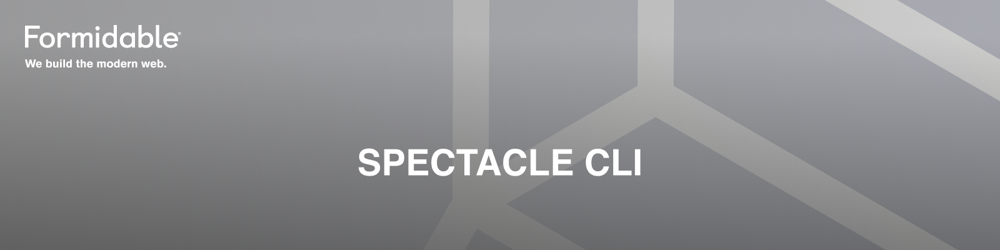

[](https://formidable.com/open-source/)

[![npm version][npm_img]][npm_site]
[![Travis Status][trav_img]][trav_site]

A generation tool for [Spectacle][] presentation decks. Includes `spectacle` and `spectacle-boilerplate`.

## Installation

Either install it globally:

```sh
$ npm install --global spectacle-cli
$ yarn global add spectacle-cli
```

to get:

- `spectacle`/`spectacle-cli`: The Spectacle CLI for one-stop spectacle presentations from a source (`.mdx` or `.md`) slide deck in a single command!
- `spectacle-boilerplate`: Generate standalone Spectacle projects with all dependencies, build scripts, and example starter decks in either JS, MDX, or Markdown.

... or use it directly with [npx][] as `npx spectacle-cli` for the CLI or `npx -p spectacle-cli spectacle-boilerplate` for the generation tool.

## The Spectacle CLI (`spectacle`)

The Spectacle CLI will create a development server to create a `.md` or `.mdx` slides-based deck with additional enhancements for theme overrides, etc.

```sh
$ spectacle -h
Create a Spectacle presentation

Commands:
  spectacle       Create a Spectacle presentation                      [default]
  spectacle init  Create a Spectacle presentation via interactive prompts

Options:
  --help, -h      Show help                                            [boolean]
  --version, -v   Show version number                                  [boolean]
  --action, -a    CLI action to run (build, server) [string] [default: "server"]
  --src, -s       Path to a file from which a presentation will be generated.
                                                [string] [default: "slides.mdx"]
  --theme, -t     Path to a JS/JSON file with theme overrides.          [string]
  --title, -l     Title for the HTML file generated by the Spectacle CLI.
                                              [string] [default: "Presentation"]
  --template, -q  The path for a template file that gets included on each slide.
                                                                        [string]
  --port, -p      Port for running the Spectacle development server.
                                                        [number] [default: 3000]
  --output, -o    Output directory for built files.   [string] [default: "dist"]
```
Some additional tips for CLI usage with flags:

- _File paths_: all file paths are relative to current working directory (`process.cwd()`) or can be absolute.
- `-a|--action`:
  - `server`: Run a development in-memory web-server with hot reload for your presentation.
  - `build`: Output a full production website static build to the `-o|--output` directory.
- `-s|--src`: The slide source file path. If a file has a `.md` suffix is processed as straight Markdown. If a file has a `.mdx` suffix it is processed as enhanced MDX.
- `-t|--theme`: A `require|import`-able file (e.g., `.js` or `.json`) that contains an object to override the Spectacle default theme in places.

An alternative to specifying all flags on the CLI is using an interactive prompt with `init`, e.g.:

```sh
$ spectacle init
✔ Create a live server or build directory? › Server
✔ What port for the live server? … 5555
✔ What is the file directory of the markdown source? Include the file extension … slides.md
✔ Do you have a custom theme file? … no
✔ Do you have a custom template file? … no

# ... and a dev server fires up!
```

## Boilerplate generation (`spectacle-boilerplate`)

Want a much more customizable experience with full build control? Then `spectacle-boilerplate` is for you!

The `spectacle-boilerplate` command generates fresh Spectacle projects of various flavors as appropriate to your needs with a fully installable `package.json`, webpack configurations, and development+build commands. You can create a vanilla JavaScript deck, or one that ingests MDX or markdown slides.

```sh
$ spectacle-boilerplate -h
Usage: spectacle-boilerplate

Options:
  --mode, -m         Deck type to generate (js, mdx, md)[string] [default: "js"]
  --name, -n         Project name (`package.json:name`)
                                    [string] [default: "spectacle-presentation"]
  --description, -e  Project description (`package.json:description`)
                                    [string] [default: "Spectacle presentation"]
  --dir, -d          Directory for generated/boilerplate files.
                                                         [string] [default: "."]
  --help, -h         Show help                                         [boolean]
  --version, -v      Show version number                               [boolean]
```

You can install `spectacle-cli` globally or locally and then run `spectacle-boilerplate`. _Or_, you can just use `npx -p spectacle-cli spectacle-boilerplate` for fully-contained one-line shell commands! Some examples:

```sh
# Generate a JavaScript deck project
$ spectacle-boilerplate

# ... or an MDX deck project with a custom name + description
$ spectacle-boilerplate \
  --mode mdx \
  --name "deck-o-awesome" \
  --description "My generated Spectacle MDX deck"

# ... or a Markdown deck project to a different directory than CWD.
$ spectacle-boilerplate \
  --mode md \
  --dir "project-o-awesome
```

## Details

### Markdown

For `.md` source files, everything is pretty straightforward -- the Markdown is parsed into Spectacle components and rendered as a deck. Slides are separated with `---`. You can find a working example in `examples/cli-md` in the project repository.

### MDX

For `.mdx` source files, things are slightly more complicated.

**Babel**: MDX produces JSX, not JS and can contain arbitrary JavaScript code along with imports. `spectacle-cli` thus has a built in babel transform of `@babel/preset-react`. If your JS/JSX enhancements in an MDX deck require more babel libraries than that, you will need to create a `.babelrc` and install dependencies in your current working directory (or above) from where you are running the CLI.

**Dependencies**: `spectacle-cli` ships with some built-in dependencies that are `resolve.alias`-ed in webpack to always be used. For example, we include `react`, `react-dom`, and (of course) the `spectacle` core library. See this projects `package.json:dependencies` for the full list. Your JS/JSX custom code used with MDX can automatically use these. For additional dependencies, please make sure to install dependencies in your current working directory (or above) from where you are running the CLI.

You can find a working example in `examples/cli-mdx-babel` in the project repository that contains a custom `.babelrc` that adds the `babel-plugin-codgen` neato features and has a custom slide that uses built-in `spectacle` components.

[npm_img]: https://badge.fury.io/js/spectacle-cli.svg
[npm_site]: http://badge.fury.io/js/spectacle-cli
[trav_img]: https://api.travis-ci.com/FormidableLabs/spectacle-cli.svg
[trav_site]: https://travis-ci.com/FormidableLabs/spectacle-cli
[spectacle]: https://formidable.com/open-source/spectacle/
[npx]: https://www.npmjs.com/package/npx


## Maintenance Status

**Active:** Formidable is actively working on this project, and we expect to continue for work for the foreseeable future. Bug reports, feature requests and pull requests are welcome.
